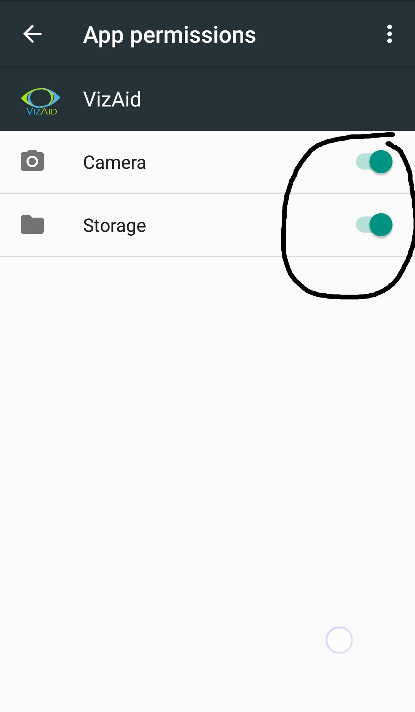

## Our code.fun.do Online Project.
## Warning 1: If your Android is or higher than 6.0 (MarshMallow) , then please provide permission externally by opening app information and
granting the required access permissions. ScreenShots are provided for reference.

## Warning 2: App will work only with Internet Access and might take some time on start and while activity description.

##VizAid  (Visual Aid)
What if blind people could the see world ?
So we built a System that would describe the world in front of them.

This app is designed basically to simplify the lives of the Visually impaired people. 
Its uses Microsoft Computer Vision API as well as Microsoft Emotion API, both offered within Microsoft Cognitive services(https://www.microsoft.com/cognitive-services). 
The app helps the blind people "see" through their Smartphone. It can help them navigate through their daily life. 
Tha app can describe most of the things around them. It can also read text for them. It can also recognize emotions of the people around them.
Not only that, it can even recognize famous personalities.
This app demonstrates image analysis, Optical Character Recognition (OCR), and face emotion detection.

* [Learn about the Computer Vision API](https://www.microsoft.com/cognitive-services/en-us/computer-vision-api)
* [Learn about the Emotion API](https://www.microsoft.com/cognitive-services/en-us/emotion-api)

## Team Name : 221B
	Member Name : Rohit Lodha
	Member Name : Vivek Singhvi
	Member Name : Akshit Kumar

## The Client Library
The client library is a thin Java client wrapper for the Computer Vision API.

In order to run the app, com.microsoft.projectoxford.vision package and com.microsoft.projectoxford.emotion from Maven Central Repository are being used.

## Requirements
Android OS must be Android 4.1 or higher (API Level 16 or higher)

## Run the Sample (In Android Studio)
1. First, you must obtain a Computer Vision API and Emotion API subscription key from (<https://www.microsoft.com/cognitive-services/en-us/sign-up>).

2.  Start Android Studio and open project from Vision \> Android \> Sample folder.

3.  In Android Studio -\> "Project" panel -\> "Android" view, open file
    "app/res/values/strings.xml", and find the line
    "Please\_add\_the\_subscription\_key\_here;". Replace the
    "Please\_add\_the\_subscription\_key\_here" value with your subscription key
    string from the first step. If you cannot find the file "strings.xml", it is
    in folder "Sample\app\src\main\res\values\string.xml".
    (It is already added in the app)

4.  In Android Studio, select menu "Build \> Make Project" to build the sample, and "Run" to launch this sample app.

### Run the Sample ( On Android Phone )
Install the apk file.
Give the required permissions.()
Now open the app and the app will itself guide you around the app.
Swipe Down for tips.
Double CLick to describe image around you.
Swipe right for reading text.
Swipe left for recognizing emotions.

Capture Photo using Camera and wait for the app to speak out the results.

# License

Microsoft will receive the images you upload and may use them to improve the Computer Vision
API and related services. By submitting an image, you confirm you have consent
from everyone in it.
All Microsoft Cognitive Services SDKs and samples are licensed with the MIT License.
=======

